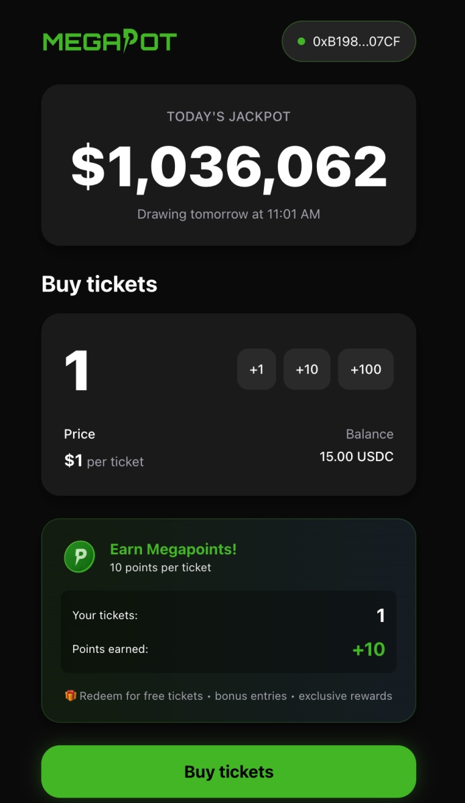
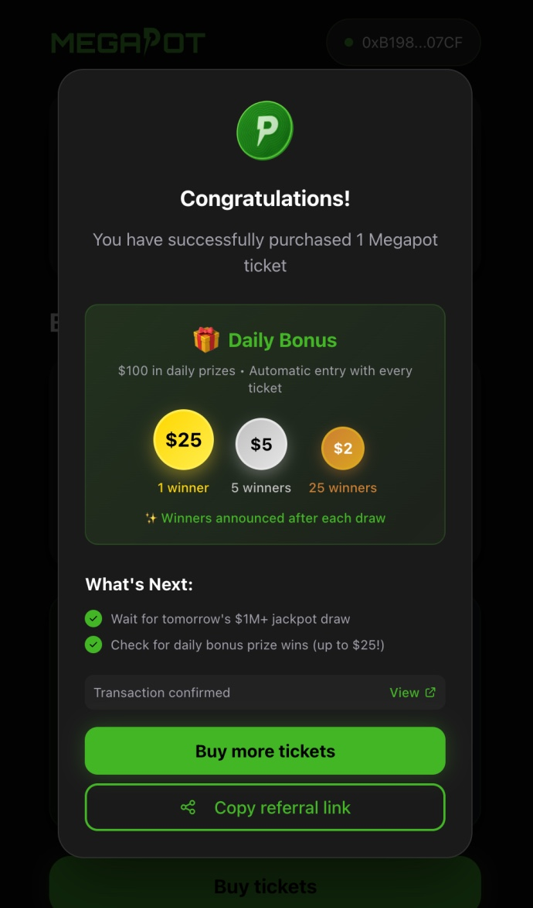
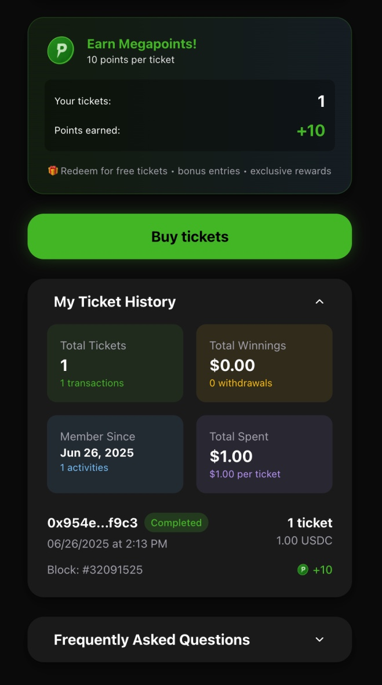

# 🧨 Megapot Demo App

Launch a $1M onchain jackpot in minutes.  
Megapot is the permissionless jackpot protocol powering fully onchain, provably fair prize pools on Base.  
Use this repo to integrate Megapot into your app, wallet, or game — or launch your own jackpot product fast.

---

## 🔥 TL;DR

- 💸 Add a $1M+ jackpot to your site and earn fees
- 🧱 Built on Base, fully open-source and production-ready
- 🎯 Incentivize any onchain action: signups, deposits, token usage
- 🛠️ Fork and customize with Cursor, Windsurf, or v0.dev

---

## 🌐 Live Demo

**Try it live:** [megapot.win](https://megapot.win)  
Connect your wallet on Base, buy tickets with USDC, and enter to win real onchain jackpots.

---

## 👀 Who This Is For

- **App builders** who want to increase user engagement with massive jackpots
- **Token teams** looking to launch branded onchain jackpots
- **Wallets, games, and dapps** that want to plug into a permissionless $1M+ prize system
- **Dev shops** seeking ready-to-go gamified incentives for clients

---

## 🖼️ Screenshots

<div align="center">

### 🎰 Main Jackpot Interface


### 🎉 Purchase Confirmation


### 📈 Ticket History + Stats


</div>

---

## 🛠️ What's Inside

This is a **production-grade Next.js 15 app**, built with the same architecture used in the live Megapot platform.

### 🧱 Core Stack

- **Next.js 15** with React 19 + TypeScript
- **TailwindCSS** with animations and design system
- **Wagmi + Viem** for type-safe Ethereum smart contract calls
- **Privy** for wallet + email auth

### 🔌 Smart Contract Features

- 🎟️ USDC ticket purchasing on Base
- ⏱️ Live jackpot countdowns + prize pools
- 🎯 Referral tracking via URL
- 📡 Real-time tx monitoring + fallback UX

### 📊 Data Layer

- **GraphQL subgraph** for indexed blockchain reads
- **TanStack Query + SWR** for caching and real-time state
- **Custom hooks** for jackpot, ticket history, and user profile

### 🧩 UI Features

- Mobile-first responsive layout (optimized for 448px)
- Animated multi-step purchase flow
- Ticket history and stats
- Megapoints system for bonus rewards
- Graceful error boundaries

### 💻 Developer Experience

- Strict **TypeScript** typing
- **ESLint + Prettier** setup
- `.env.template` config with instructions
- Clean folder structure and modular architecture

---

## ⚙️ How to Use This Repo

You can integrate Megapot in **two ways**:

### 1. 🧠 Reference & Learn

Use this repo as a reference to integrate Megapot into your existing app:

- Reuse **hooks** from `src/hooks/`
- Plug into **contract config** via `src/lib/config.ts`
- Study UI logic in `src/components/`

Perfect if you have your own design system or want to embed jackpots inside another flow.

---

### 2. 🚀 Clone & Customize

Fork this repo and make it your own:

- Use AI tools like **Cursor**, **Windsurf**, or **v0.dev** to redesign UI
- Replace colors, branding, and assets
- Add custom contract features or modify flows
- Launch your own jackpot game in days, not weeks

---

## 📦 Quick Start

```bash
git clone https://github.com/megapot-xyz/demo.git
cd demo
pnpm install
pnpm dev
```

